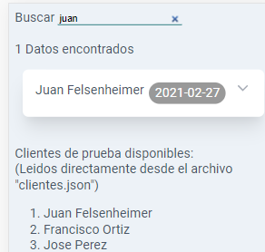

# Simple json reader with Vue2.

## ¿Qué es este repo?
Nada más que un lector de archivos json, el prototipo inicial que se utilizó en el proyecto OptimarDB (el repo original privado).

## Características
- Vue2, archivo minificado.
- Acordeón para desplegar la info.
- Single Web Application (SWA).
- Responsive.

## Agradecimientos
Vue es un gran fw para trabajar en FrontEnd, lo recomiendo totalmente.